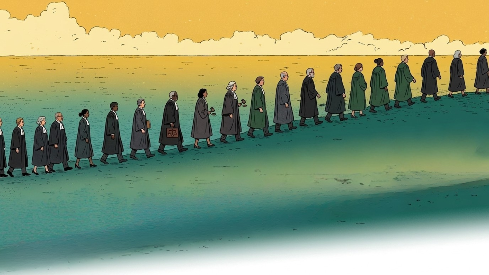

<p align="center">
  
</p>

# Adduce: Issue. Prove. Settle.

The first credential issuer for legal aid on Solana. Adduce digitizes the eligibility certificate, the single paper artifact that crosses institutional boundaries every time a lawyer gets paid, by issuing it as a cryptographically signed on-chain attestation with zero-knowledge selective disclosure and instant settlement.

**[SDK](https://www.npmjs.com/package/@adduce/sdk) | [Documentation](https://github.com/SAHU-01/legal_aid/tree/main/app/src/app/docs) | [Explorer](https://explorer.solana.com/address/3f1yBTY6xb6ESdzzb9LxAozv7uVsj9Y9AMEpnAwKJRNV?cluster=devnet) | [Our Story](https://github.com/SAHU-01/legal_aid/tree/main/app/src/app/story)**

**14 instructions. 4 events. 26 error codes. Deployed on Solana Devnet.**

## Live on Devnet

| Resource | Address | Verify |
|----------|---------|--------|
| Legal Aid Program | `3f1yBTY6xb6ESdzzb9LxAozv7uVsj9Y9AMEpnAwKJRNV` | [Explorer](https://explorer.solana.com/address/3f1yBTY6xb6ESdzzb9LxAozv7uVsj9Y9AMEpnAwKJRNV?cluster=devnet) |
| SAS Program | `22zoJMtdu4tQc2PzL74ZUT7FrwgB1Udec8DdW4yw4BdG` | [Explorer](https://explorer.solana.com/address/22zoJMtdu4tQc2PzL74ZUT7FrwgB1Udec8DdW4yw4BdG?cluster=devnet) |
| SAS Schema | `7uKMGSgup1UZ26MnptCCMCac6rqpe6vBNXET338cDeid` | [Explorer](https://explorer.solana.com/address/7uKMGSgup1UZ26MnptCCMCac6rqpe6vBNXET338cDeid?cluster=devnet) |
| Encrypted Document (Arweave) | `2Cyx7gpJgDmivrgDiaCnwsrVCAWqkUMRVWCyDaNAVymn` | [Irys Devnet Gateway](https://devnet.irys.xyz/2Cyx7gpJgDmivrgDiaCnwsrVCAWqkUMRVWCyDaNAVymn) |
| ZK Circuit | 7,883 constraints, 256-byte proof | [Test proof](circuits/test_proof.js) |
| SDK | `@adduce/sdk` v0.1.0 | [npm](https://www.npmjs.com/package/@adduce/sdk) |

## Three Pillars

**01. Issue.** Court authority signs an on-chain attestation (SAS) binding the citizen to jurisdiction, eligibility tier, and expiry. Poseidon commitment root hashes all fields for ZK. Supports both wallet-based and custodial issuance (citizen without wallet). Credential survives issuing-server failure.

**02. Prove.** Holder generates a 256-byte Groth16 zero-knowledge proof: "jurisdiction is DE and credential is not expired" without revealing tier, identity, or dates. Verified on-chain via Solana's native alt_bn128 pairing in ~200k compute units. Lawyer proves case assignment via SHA-256 commitment (pubkey never on-chain).

**03. Settle.** Case closed + credential unrevoked + disbursed amount <= authorized amount = payment. Supports both on-chain USDC (400ms) and off-chain bank transfer with on-chain payment reference for audit. Government pays per transaction, no servers to maintain.

## Install the SDK

```bash
npm install @adduce/sdk
```

```typescript
import { AdduceClient } from "@adduce/sdk";

const adduce = new AdduceClient({ cluster: "devnet", wallet });
const { casePda } = await adduce.openCase({
  caseId: "CASE-DE-2025-001",
  lawyerPubkey, applicant, authorizedAmount: 8500,
}, "DE");
await adduce.closeCase("CASE-DE-2025-001", credentialAddress, "DE");
await adduce.markPaid({ caseId: "CASE-DE-2025-001", disbursedAmount: 8500, paymentReference: "INV-001" }, "DE");
```

No cloning. No deploying. No scripts. Connect to the already-deployed program and call functions.

**[View on npm](https://www.npmjs.com/package/@adduce/sdk)**

## Quick Start (Full Repo)

```bash
git clone https://github.com/SAHU-01/legal_aid.git && cd legal_aid
nvm use 22 && npm install
cp .env.example .env   # add your Helius API key
anchor build && anchor deploy --provider.cluster devnet
npm run dev            # start frontend at localhost:3000
```

Run the full pipeline (credential issuance through payment, all on devnet):

```bash
npx ts-node scripts/e2e-full-pipeline.ts
```

Run the ZK selective disclosure demo:

```bash
cd circuits && npm install && ./build.sh
cd .. && npx ts-node scripts/zk-disclosure-demo.ts
```

## Program Instructions (14)

### Core Flow
| Instruction | Signer | What It Does |
|-------------|--------|-------------|
| `initialize` | Authority | Creates ProgramConfig (293 bytes) with roles, operations wallet, timeout |
| `open_case` | Authority | Creates CaseFile (404 bytes) with lawyer_commitment + authorized_amount |
| `open_case_custodial` | Authority | Same but for citizens without wallets (hashed national ID) |
| `link_credential` | Reviewer / Delegate | Binds SAS credential to case. 5-point validation. Supports custodial nonce. |
| `anchor_document` | Lawyer (via salt) | Stores document hash. Lawyer proves identity via SHA-256 commitment. |
| `close_case` | Reviewer / Delegate | Closes case. Credential liveness re-checked. Timeout escalation. |
| `mark_paid` | Payer | Records disbursed_amount + payment_reference. Enforces amount <= authorized. |

### Extended
| Instruction | Signer | What It Does |
|-------------|--------|-------------|
| `reassign_lawyer` | Authority / Reviewer | Switch lawyer on active case with audit trail (LawyerReassigned event) |
| `update_case_status` | Authority / Reviewer | Non-linear: Stayed, Appealed, Withdrawn, Remanded |
| `reopen_case` | Authority | Move Closed back to InProgress with reason |
| `verify_zk_disclosure` | Any | Verify 256-byte Groth16 proof on-chain (alt_bn128) |
| `add_delegate` | Authority | Add delegate reviewer (max 3) |
| `remove_delegate` | Authority | Remove delegate |
| `fund_operations` | Authority | Top up operations wallet for transaction fees |

### Case Status (8 states)
```
Open -> InProgress -> Closed -> Paid
                   <-> Stayed (court stay)
                   <-> Appealed (reversible)
                   -> Withdrawn (applicant withdraws)
       Closed      -> Remanded (higher court, returns to InProgress)
       Closed      -> InProgress (via reopen_case)
```

## Storage Architecture

Adduce uses a layered storage model. No personal data touches the public ledger.

| Data | Where | Technology | Who Can Read |
|------|-------|-----------|-------------|
| Credentials | Solana PDA | SAS attestation | Anyone (fields hidden behind Poseidon commitments) |
| Case state | Solana PDA | Anchor CaseFile | Anyone (lawyer identity is a SHA-256 hash) |
| Document hash | Solana PDA | SHA-256 fingerprint | Anyone (one-way, can't reconstruct document) |
| Audit logs | Solana compressed | Light Protocol + Helius Photon | Helius RPC users (not publicly enumerable) |
| Encrypted documents | Arweave | Irys upload + X25519+AES-256-GCM | Only assigned lawyer (holds decryption key) |
| Original case files | Government DMS | Unchanged | Existing access controls |
| Citizen personal data | Government DB | Never on blockchain | Government staff under GDPR |

### Encrypted Document Storage (Arweave + Irys)

Documents are encrypted end-to-end and stored permanently on Arweave via Irys:
1. Court encrypts document for the assigned lawyer (X25519 ECDH + AES-256-GCM)
2. Encrypted blob uploaded to Arweave via Irys (pay-per-upload with SOL)
3. Plaintext hash anchored on Solana (proves document existed)
4. Lawyer fetches from Arweave, decrypts with their wallet key

Each user/jurisdiction pays for their own storage via their Solana wallet. Storage is permanent (pay once, stored forever). Encrypted documents are content-addressable (tamper-proof URL). Browse uploads at: `https://explorer.irys.xyz/address/<wallet-pubkey>`

### ZK Compression (Light Protocol)

| Method | Cost per case | At 100K cases/year |
|--------|--------------|-------------------|
| Standard PDA | ~$0.30 | ~$30,000/year |
| ZK Compressed | ~$0.004 | ~$400/year |

98.8% cost reduction. Requires Helius RPC (Photon indexer built in).

## Tech Stack

| Component | Technology | Purpose |
|-----------|-----------|---------|
| Smart Contracts | Anchor 0.32 / Rust | 14 instructions, case lifecycle, ZK verification |
| ZK Circuits | Circom 2.2 / snarkjs / Groth16 | Selective disclosure + predicate proofs (BN254) |
| On-Chain Verifier | `sol_alt_bn128_group_op` syscall | Groth16 proof verification (~200k CU) |
| Identity | Solana Attestation Service (SAS) | Government-issued credentials |
| Compression | Light Protocol + Photon Indexer | ZK-compressed audit logs (98.8% savings) |
| Document Storage | Arweave + Irys | Encrypted permanent document storage |
| Encryption | X25519 + AES-256-GCM (sha2 crate) | Document encryption + lawyer commitment privacy |
| Payments | x402 Protocol v2 | Credential-gated USDC disbursement |
| Frontend | Next.js 16 / React 19 / Tailwind 4 | Lawyer dashboard + docs |
| RPC | Helius | Devnet RPC + Photon indexer |

## Project Structure

```
legal-aid-plugin/
  programs/legal-aid/src/
    lib.rs                  14 instructions, 4 events, 26 error codes
    groth16.rs              On-chain Groth16 verifier (BN254 pairing via alt_bn128)
    vk.rs                   Auto-generated verification key (trusted setup ceremony)
  circuits/
    selective_disclosure.circom   Groth16 circuit (6 fields, depth-3 Merkle, Poseidon)
    build.sh                      Compile + Powers of Tau + phase 2 setup
    test_proof.js                 Generate + verify test proof locally
  app/src/app/
    page.tsx                Landing page
    dashboard/              Lawyer demo dashboard
    docs/                   Technical documentation (14 instructions, integration guide)
    api/claim-payment/      x402 payment endpoint with SAS verification
  scripts/
    lib/privacy.ts          X25519+AES-256-GCM encryption, Merkle commitments
    lib/zk-prover.ts        Groth16 proof generation, Poseidon hashing, Solana formatting
    lib/connection.ts       Helius RPC setup
    e2e-full-pipeline.ts    10-step lifecycle: open -> credential -> anchor -> close -> pay
    zk-disclosure-demo.ts   ZK pipeline: credential -> Groth16 proof -> verify
    encrypt-and-anchor.ts   Document encryption + Arweave upload + hash anchoring
    upload-to-arweave.ts    Encrypted document upload to Arweave via Irys
    agent.ts                Automation: polls closed cases, compresses, pays
    issue-credential.ts     Issue SAS eligibility credential
    revoke-credential.ts    Revoke credential (account deletion)
    selective-verify.ts     Merkle-based selective disclosure demo
    cost-comparison.ts      Standard PDA vs compressed storage costs
```

## Scripts

| Script | What It Does | Status |
|--------|-------------|--------|
| `e2e-full-pipeline.ts` | Complete lifecycle with report + Explorer links | Live |
| `zk-disclosure-demo.ts` | ZK proof generation + local + on-chain verification | Live |
| `encrypt-and-anchor.ts` | Encrypt doc (AES-256-GCM) + anchor hash on Solana | Live |
| `upload-to-arweave.ts` | Upload encrypted doc to Arweave via Irys | Live |
| `agent.ts` | Automation agent: poll, compress, pay, mark paid | Live |
| `issue-credential.ts` | Issue SAS eligibility credential to wallet | Live |
| `verify-credential.ts` | Verify SAS credential on devnet | Live |
| `revoke-credential.ts` | Revoke credential (delete account) | Live |
| `selective-verify.ts` | Merkle-based selective disclosure demo | Live |
| `cost-comparison.ts` | Standard vs compressed storage cost analysis | Live |
| `anchor-document-compressed.ts` | Anchor hash via Light Protocol compression | Live |
| `query-compressed.ts` | Query compressed state via Photon indexer | Live |
| `create-schema.ts` | Deploy SAS credential schema to devnet | Live |

## Countries with Certificate-Based Legal Aid

Adduce is tested with the German jurisdiction but the architecture is jurisdiction-agnostic. The same program serves any country by changing the jurisdiction parameter in `initialize`.

| Country | Certificate Name |
|---------|-----------------|
| Germany | Berechtigungsschein |
| Netherlands | Toevoeging |
| France | Aide Juridictionnelle |
| Italy | Patrocinio a spese dello Stato |
| Spain | Asistencia Juridica Gratuita |
| Austria | Verfahrenshilfe |
| Portugal | Apoio Judiciario |
| Canada | Legal Aid Certificate |
| Ireland | Legal Aid Certificate |

9 countries. 500M+ citizens covered. One deployment.

## License

This project is source-available under a proprietary non-commercial license. You may view, fork, and use the code for personal and educational purposes. Commercial use requires written permission from the author. See [LICENSE](./LICENSE) for details.
